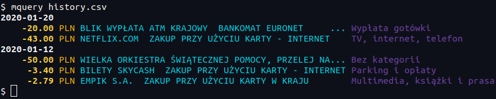
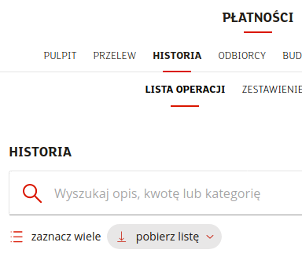
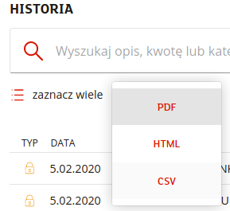

# mquery

`mquery` is a command-line tool for reading and filtering your mBank history exports.



**Disclaimer**

This IS NOT an official tool, which means it IS NOT supported or endorsed by mBank.

## Installation

1. Install Python 3.
2. Clone this repository.
3. Enter `mquery` directory and run `pip3 install -e .`

## Usage

Run `mquery FILE` to read history from a CSV file.

Run `mquery --help` to see information about available filters and options.

### Examples

See all entries between December 1 2019 and January 25 2020:

```
mquery history.csv --date-from 2019-12-01 --date-to 2020-01-25
```

See all entries with phrase "restaurant" in description:

```
mquery history.csv --description restaurant
```

See all entries since January 1 2020 with amount greater than 40 PLN:

```
mquery history.csv --amount-from 40 --date-from 2020-01-01
```

Include summary of incomes and expenses:

```
mquery history.csv --summary
```

## How to export your history

1. Go to the mBank website and log in to your account.
2. Got to *Płatności* > *Lista operacji*.
3. Use filters to select period that you want to export.
4. Click on *pobierz listę*.

    

5. Select *CSV* from the dropdown menu and save the file on your disk.

    
